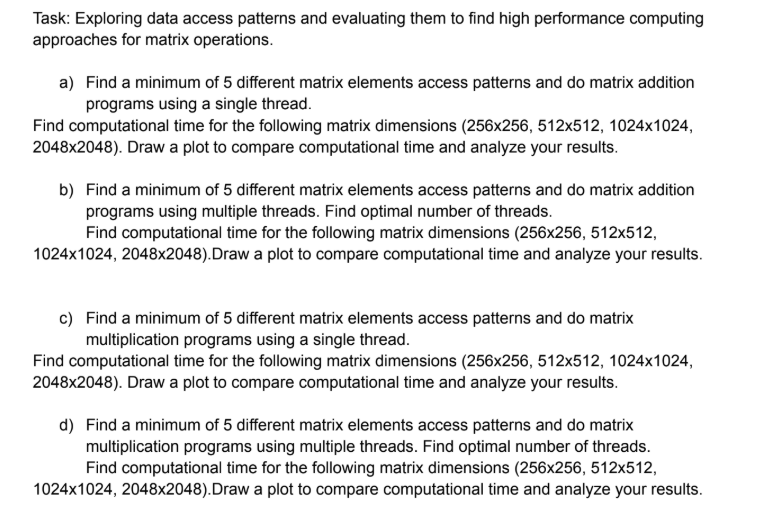

# HPC Assignment 1  
## Matrix Data Access Patterns and Performance Evaluation

---

## Assignment Structure

The assignment is divided into four parts:

1. Single-threaded matrix addition  
2. Multi-threaded matrix addition  
3. Single-threaded matrix multiplication  
4. Multi-threaded matrix multiplication  

Each part is implemented using **five different data access patterns**.

---

## Access Patterns Used

### Addition
- Row-major
- Column-major
- Zigzag (snake traversal)
- Diagonal traversal
- Blocked (tiled)
- Transposed access (multi-threaded only)

### Multiplication
- i–j–k loop order
- i–k–j loop order
- k–i–j loop order
- Blocked multiplication
- Transpose-based multiplication
- Cyclic row partitioning (multi-threaded)

---

## Team Contribution and Task Division

| Member Name | Q1 | Q2 | Q3 | Q4 |
|------------|----|----|----|----|
| Anil | Row-major | Column-major | i–k–j | Blocked (threads) |
| Prakhar | Column-major | Zigzag | k–i–j | Transpose (threads) |
| Akash | Zigzag | Diagonal | Blocked | i–k–j (threads) |
| Sowmya | Diagonal | Blocked | Transpose | k–i–j (threads) |
| Manish | Blocked | Transposed | i–j–k | Cyclic row partition |

Each member independently implemented, tested, and analyzed their assigned access pattern.

---

## Matrix Sizes Tested
- 256 × 256  
- 512 × 512  
- 1024 × 1024  
- 2048 × 2048  

---

## Threading Details
- Threads created manually using pthread / std::thread
- Row-based and cyclic partitioning used to avoid race conditions
- Thread counts tested: 1, 2, 4, 8, 16
- Optimal thread count determined experimentally

---

## Reports and Plots
Detailed analysis and performance plots for each question are provided in the `reports/` directory.

## To get started, read [howToStart.md](./howToStart.md)

---

## Additional Access Patterns (Optional – Individual Exploration)

The following access patterns can be explored independently for further study:
- Reverse row-major
- Strided access
- Morton (Z-order) traversal
- Cache-oblivious recursion
- Wavefront access
- False-sharing inducing layouts
- Software prefetching

These are **not required** but may be implemented individually for deeper understanding.

---