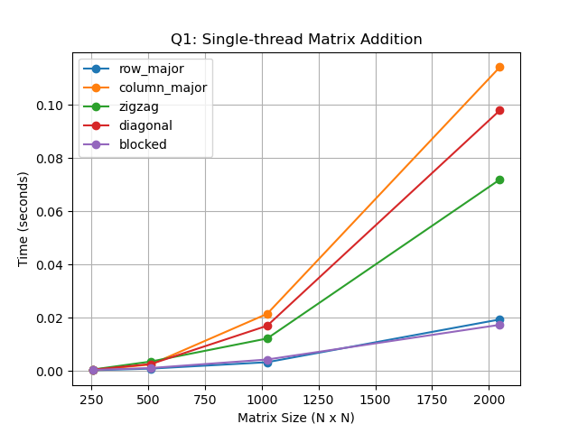

## Getting Started

This file is meant to help everyone get started smoothly and work in a similar way.  
It is **not strict rules**, just a common approach so that results are easy to combine later.

---

## 1. Where to Start

Each person is assigned **specific access methods for each question**.

To begin:
1. Go to the folder of the question you are working on  
2. Open the access-method folder assigned to you  
3. Start coding inside that file only  

Example:
```
Q1_single_thread_addition/row_major/add_row_major.c
```
You do **not** need to create new folders or files.

---

## 2. Boilerplate Code

All source files already contain:
- Required `#include` statements
- Matrix allocation helpers
- Timing utilities
- Thread helpers (for multi-threaded questions)

So you only need to:
- Write the **core computation logic**
- Call the timing utilities
- Store the results

No need to add or modify includes (***Depends on YOu***).

---

## 3. What You Should Implement

Inside your assigned file, your code should do the following:

1. Initialize matrices using the provided utilities  
2. Implement **your access pattern logic**  
3. Measure computation time  
4. Save the result in a CSV file  

A typical flow will look like:
- Setup matrix
- Start timer
- Perform computation
- Stop timer
- Store result
- Free memory

---

## 4. Timing the Code

Timing utilities are already provided.

Please try to:
- Measure only the **computation part**
- Exclude memory allocation and initialization
- Run each case a few times and store the average

Matrix sizes to test:
```256, 512, 1024, 2048```


For multi-threaded versions, test multiple thread counts (for example: 1, 2, 4, 8, 16).

---

## 5. Storing Results (CSV Files)

Instead of printing results on the terminal, store them in CSV files.

Each access method will have **one CSV file**.

Location:
```reports/QX_results/```

Example:
```reports/Q1_results/row_major.csv```

CSV format:
```
matrix_size,threads,time_seconds
256,1,0.00412
512,1,0.03155
1024,1,0.24188
2048,1,1.90231
```

For single-threaded programs, `threads` will always be `1`.

---

## 6. Plotting Results (PNG Graphs)

Graphs will be generated **after all CSV files are ready**.

General idea:
1. Everyone generates CSV files only
2. A common plotting utility reads all CSVs
```
    python tools/plot_results.py \
        reports/Q1_results/row_major.csv \
        reports/Q1_results/column_major.csv \
        reports/Q1_results/zigzag.csv \
        reports/Q1_results/diagonal.csv \
        reports/Q1_results/blocked.csv \
        "Q1: Single-thread Matrix Addition" \
        reports/plots/Q1_addition_single.png
```
3. Plots are saved as PNG files
    

Plots will be stored in:
```reports/plots/```

Each plot will compare different access methods for the same question.

---

## 7. Writing the Analysis (Markdown)

Each question has its own analysis file:
```
reports/Q1_analysis.md
reports/Q2_analysis.md
reports/Q3_analysis.md
reports/Q4_analysis.md
```

For your assigned access method, please add a small section with:
- What access pattern you used
- How performance changed with matrix size
- Any noticeable difference compared to other methods

Example:
```markdown
### Row-Major Access (Anil)

Row-major access performed consistently well due to contiguous memory access.
As matrix size increased, the execution time increased linearly and cache behavior
remained stable compared to column-major access.
Keep it short and technical.
```
## 8. General Notes
Everyone is free to experiment beyond their assigned task

Just keep final results and documentation clean

If something feels unclear, we can always adjust together

The main goal is:
- Clear individual contribution
- Easy comparison of access patterns
- Clean final submission

## 9. Final Step
Once all:
- Code is done
- CSV files are generated
- plots are stored as png
- Analysis is written

Document will be made and Everything will be combined into a single zip file for submission.